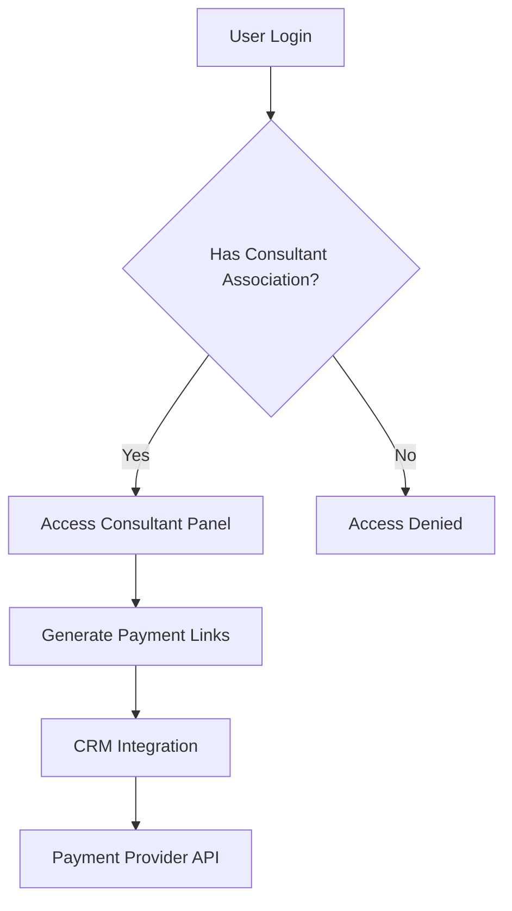
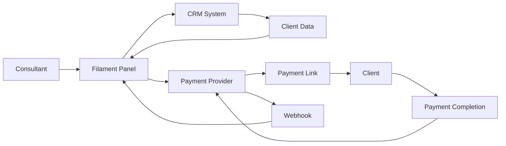

# Design Document

## Overview

The consultant payment links system extends the existing Firaga CMS with a dedicated Filament panel for consultants to generate and manage payment links for their clients. The system integrates with external CRM data and payment providers while maintaining separation of concerns between admin and consultant functionalities.

## Architecture

### Multi-Panel Architecture

The system leverages Filament's multi-panel capability to create a separate consultant interface:

- **Admin Panel** (`/admin`) - Existing administrative interface for system management
- **Consultant Panel** (`/consultants`) - New dedicated interface for consultant operations

### Authentication Flow



### Data Flow Architecture



## Components and Interfaces

### 1. Database Schema

#### User-Consultant Junction Table
```sql
CREATE TABLE user_consultant (
    user_id INTEGER NOT NULL,
    consultant_id INTEGER NOT NULL,
    created_at DATETIME,
    updated_at DATETIME,
    PRIMARY KEY (user_id, consultant_id),
    FOREIGN KEY (user_id) REFERENCES users(id) ON DELETE CASCADE,
    FOREIGN KEY (consultant_id) REFERENCES consultants(id) ON DELETE CASCADE
);
```

#### Consultant Payments Table
```sql
CREATE TABLE consultant_payments (
    id INTEGER PRIMARY KEY AUTOINCREMENT,
    consultant_id INTEGER NOT NULL,
    provider ENUM('abacatepay') NOT NULL,
    provider_id VARCHAR(255),
    payment_url TEXT,
    amount DECIMAL(10,2) NOT NULL,
    status ENUM('PENDING', 'EXPIRED', 'CANCELLED', 'PAID', 'REFUNDED') DEFAULT 'PENDING',
    client_name VARCHAR(255),
    client_email VARCHAR(255),
    client_phone VARCHAR(255),
    client_cpf VARCHAR(14),
    crm_opportunity_id VARCHAR(255),
    created_at DATETIME,
    updated_at DATETIME,
    FOREIGN KEY (consultant_id) REFERENCES consultants(id) ON DELETE CASCADE
);
```

### 2. Filament Panel Provider

**Location**: `app/Providers/Filament/ConsultantPanelServiceProvider.php`

```php
<?php

namespace App\Providers\Filament;

use Filament\Http\Middleware\Authenticate;
use Filament\Http\Middleware\AuthenticateSession;
use Filament\Http\Middleware\DisableBladeIconComponents;
use Filament\Http\Middleware\DispatchServingFilamentEvent;
use Filament\Pages\Dashboard;
use Filament\Panel;
use Filament\PanelProvider;
use Filament\Support\Colors\Color;
use Filament\Widgets\AccountWidget;
use Filament\Widgets\FilamentInfoWidget;
use Illuminate\Cookie\Middleware\AddQueuedCookiesToResponse;
use Illuminate\Cookie\Middleware\EncryptCookies;
use Illuminate\Foundation\Http\Middleware\VerifyCsrfToken;
use Illuminate\Routing\Middleware\SubstituteBindings;
use Illuminate\Session\Middleware\StartSession;
use Illuminate\View\Middleware\ShareErrorsFromSession;

class ConsultantPanelServiceProvider extends PanelProvider
{
    public function panel(Panel $panel): Panel
    {
        return $panel
            ->id('consultant')
            ->path('consultants')
            ->login()
            ->colors(['primary' => Color::Blue])
            ->authGuard('web')
            ->authMiddleware([
                Authenticate::class,
            ])
            ->discoverResources(in: app_path('Filament/Consultant/Resources'), for: 'App\\Filament\\Consultant\\Resources')
            ->pages([Dashboard::class])
            ->pages([
                Dashboard::class,
            ])
            ->discoverWidgets(in: app_path('Filament/Consultant/Widgets'), for: 'App\Filament\Consultant\Widgets')
            ->widgets([
                AccountWidget::class,
                FilamentInfoWidget::class,
            ])
            ->middleware([
                EncryptCookies::class,
                AddQueuedCookiesToResponse::class,
                StartSession::class,
                AuthenticateSession::class,
                ShareErrorsFromSession::class,
                VerifyCsrfToken::class,
                SubstituteBindings::class,
                DisableBladeIconComponents::class,
                DispatchServingFilamentEvent::class,
            ])
            ->authMiddleware([
                Authenticate::class,
            ]);
    }
}

```

### 3. Authentication Middleware

**Location**: `app/Http/Middleware/EnsureConsultantAccess.php`

Validates that authenticated users have consultant associations before accessing the consultant panel.

### 4. Payment Resource

**Location**: `app/Filament/Consultant/Resources/PaymentResource.php`

Provides CRUD operations for consultant payments with:
- Custom create page with CRM integration
- Status tracking and filtering
- Payment link generation
- Client data auto-population

### 5. CRM Integration Service

**Location**: `app/Services/CrmIntegrationService.php`

Handles communication with external CRM system:
- Fetch consultant opportunities by external_id
- Extract client information from leads
- Update payment status in CRM

### 6. Payment Provider Service

**Location**: `app/Services/PaymentProviderService.php`

Abstract service with provider-specific implementations:
- AbacatePay integration
- Payment link generation
- Status synchronization
- Webhook handling

## Data Models

### 1. UserConsultant Model

**Location**: `app/Models/UserConsultant.php`

```php
class UserConsultant extends Model
{
    protected $table = 'user_consultant';
    
    public function user(): BelongsTo
    {
        return $this->belongsTo(User::class);
    }
    
    public function consultant(): BelongsTo
    {
        return $this->belongsTo(Consultant::class);
    }
}
```

### 2. ConsultantPayment Model

**Location**: `app/Models/ConsultantPayment.php`

```php
class ConsultantPayment extends Model
{
    protected $casts = [
        'amount' => 'decimal:2',
        'status' => PaymentStatus::class,
        'provider' => PaymentProvider::class,
    ];
    
    public function consultant(): BelongsTo
    {
        return $this->belongsTo(Consultant::class);
    }
}
```

### 3. Enhanced User Model

Add consultant relationship and panel access control to existing User model:

```php
public function consultants(): BelongsToMany
{
    return $this->belongsToMany(Consultant::class, 'user_consultant');
}

public function hasConsultantAccess(): bool
{
    return $this->consultants()->exists();
}

public function canAccessPanel(Panel $panel): bool
{
    // Panel access control - will be implemented with consultant validation
    return true; // This will be changed to validation logic
}
```

### 4. Enhanced Consultant Model

Add payment relationship to existing Consultant model:

```php
public function payments(): HasMany
{
    return $this->hasMany(ConsultantPayment::class);
}

public function users(): BelongsToMany
{
    return $this->belongsToMany(User::class, 'user_consultant');
}
```

## Error Handling

### 1. CRM Integration Failures
- Graceful degradation when CRM is unavailable
- Manual client data entry fallback
- Retry mechanisms for temporary failures
- Comprehensive error logging

### 2. Payment Provider Failures
- Transaction rollback on payment creation failure
- Status synchronization error handling
- Webhook validation and security
- Dead letter queue for failed webhooks

### 3. Authentication Failures
- Clear error messages for unauthorized access
- Proper redirect handling
- Session management across panels
- Audit logging for security events

## Testing Strategy

### 1. Unit Tests
- **Models**: Relationship validation, business logic
- **Services**: CRM integration, payment provider communication
- **Middleware**: Authentication and authorization logic

### 2. Feature Tests
- **Panel Access**: Authentication flow, authorization checks
- **Payment Creation**: End-to-end payment link generation
- **CRM Integration**: Client data retrieval and population
- **Status Updates**: Webhook processing and status synchronization

### 3. Integration Tests
- **Multi-Panel**: Ensure panels operate independently
- **Database**: Transaction integrity and foreign key constraints
- **External APIs**: Mock CRM and payment provider responses

### 4. Browser Tests
- **User Workflows**: Complete consultant payment creation flow
- **UI Interactions**: Form validation, auto-population behavior
- **Cross-Panel Navigation**: Ensure proper session handling

## Security Considerations

### 1. Authentication & Authorization
- Panel-specific authentication middleware
- Role-based access control for consultant features
- Session isolation between panels

### 2. Data Protection
- Encrypted storage of sensitive payment data
- PCI compliance considerations for payment information
- GDPR compliance for client data handling

### 3. API Security
- Webhook signature validation
- Rate limiting for external API calls
- Secure credential management for CRM and payment providers

### 4. Audit Trail
- Comprehensive logging of payment operations
- User action tracking across panels
- Security event monitoring and alerting

## Performance Considerations

### 1. Database Optimization
- Proper indexing on foreign keys and status columns
- Query optimization for payment listing and filtering
- Connection pooling for external API calls

### 2. Caching Strategy
- Cache CRM client data for improved response times
- Redis-based session management for multi-panel support
- API response caching with appropriate TTL

### 3. Asynchronous Processing
- Queue-based webhook processing
- Background CRM synchronization
- Batch payment status updates

## Deployment Strategy

### 1. Database Migrations
- Sequential migration files for new tables
- Foreign key constraint validation
- Data seeding for payment status enums

### 2. Configuration Management
- Environment-specific CRM and payment provider settings
- Panel registration in service provider configuration
- Feature flag support for gradual rollout

### 3. Monitoring & Observability
- Application performance monitoring
- External API health checks
- Payment processing metrics and alerting